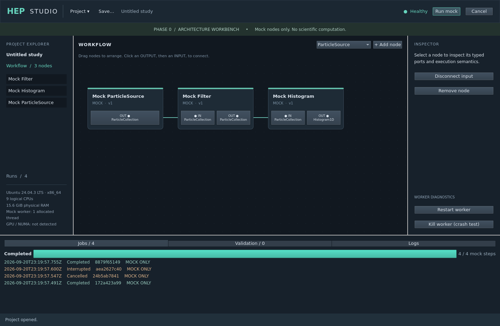

# Hep Studio

Scientific workflow desktop application; frozen Part 4 release candidate, with Linux evidence and explicit unverified host limits.

## Technology

C++23, Qt 6, Python, ROOT, PYTHIA, FastJet and collider-analysis integrations.

## Source

The complete current source snapshot contains **516 files**, including its original folder structure and project documentation.

[Download complete source](hep-studio-source.zip)

Extract the ZIP, then open the `hep-studio/` folder. Its original `README.md` contains the project-specific setup and build instructions.

## Review

Representative source excerpts are available in [CODE_EXAMPLES.md](CODE_EXAMPLES.md). The excerpts are for review; use the complete source snapshot to build or run the project.

## Preview

Archived desktop interface preview. Current capabilities and validation are recorded in the source documentation.

## Scope and validation

The original project documentation, attribution, dependency notices and stated limitations are preserved inside the source snapshot. Existing validation evidence is retained; this repository upload does not imply new runtime or platform validation.

Private signing keys, local credentials and hosting metadata are excluded.
